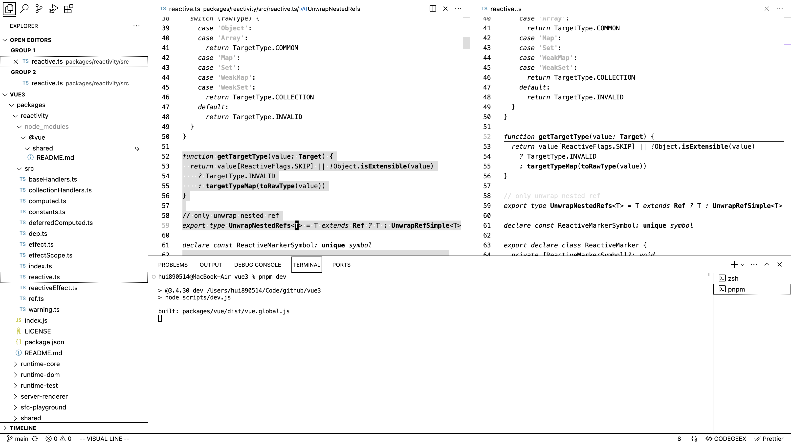
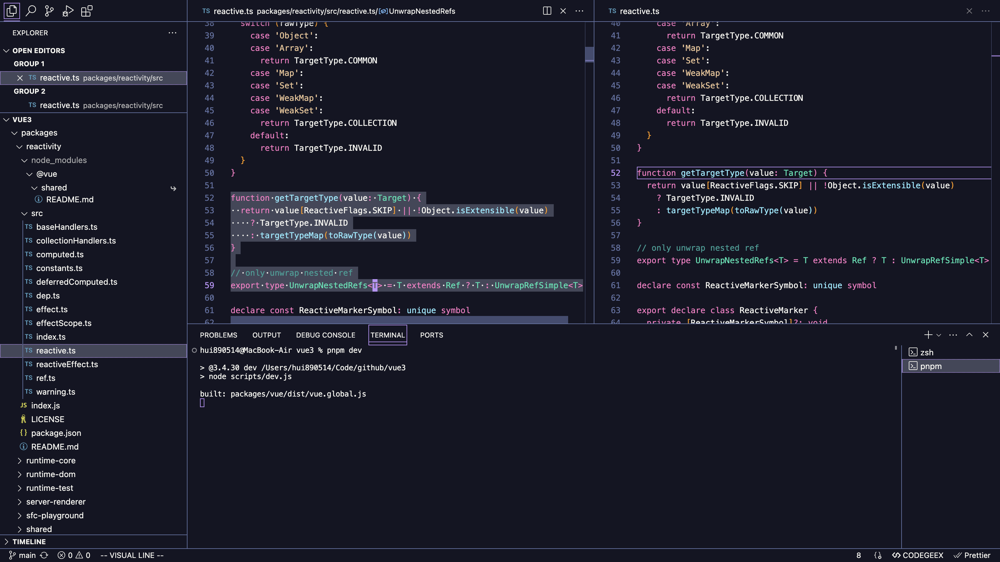
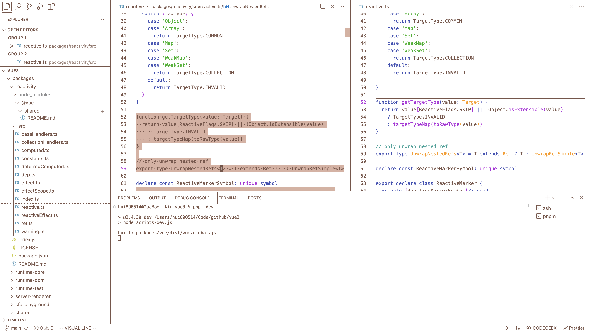

# E-Ink Theme for VSCode

This is a VSCode theme designed specifically for E-Ink displays.

## Screenshots

### E-Ink

### E-Ink Color Dark

### E-Ink Color Light

I test the E-Ink theme on the DASUNG Paperlike HD 13.3-inch display with Text Mode and Fast+++, and the E-Ink Color theme on the Bigme B251 25.3-inch display with Web Mode.

## Thanks

> Some colors of the E-Ink Color Dark theme come from [Evondev Dracula](https://marketplace.visualstudio.com/items?itemName=evondev.dracula-high-contrast).

If you find a bug or have any ideas to improve the theme, feel free to submit an issue or pull request on the [project repo](https://github.com/hui890514/vscode-theme-e-ink), I would be very grateful.

## License

[MIT License](https://github.com/hui890514/vscode-theme-e-ink/blob/main/LICENSE) © 2024-PRESENT [慧](https://github.com/hui890514)
